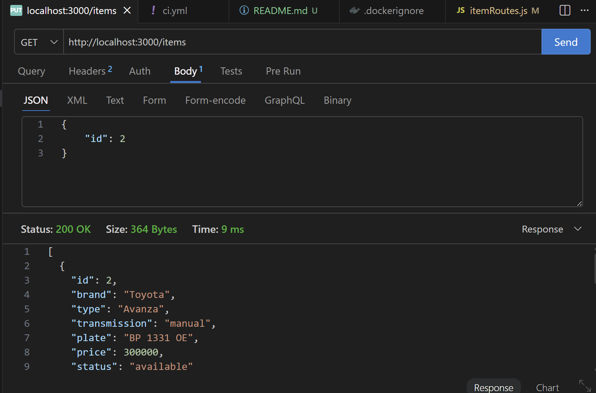
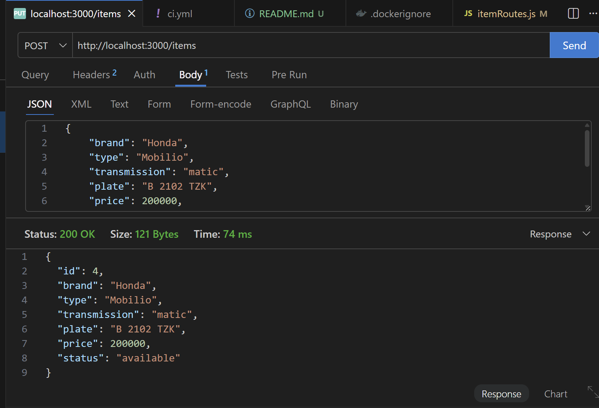
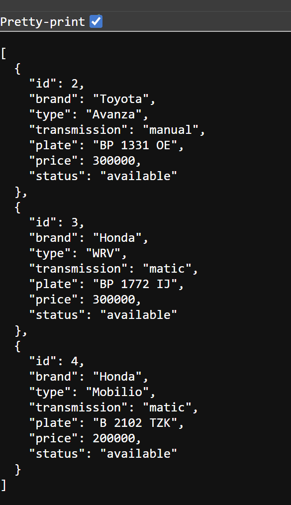
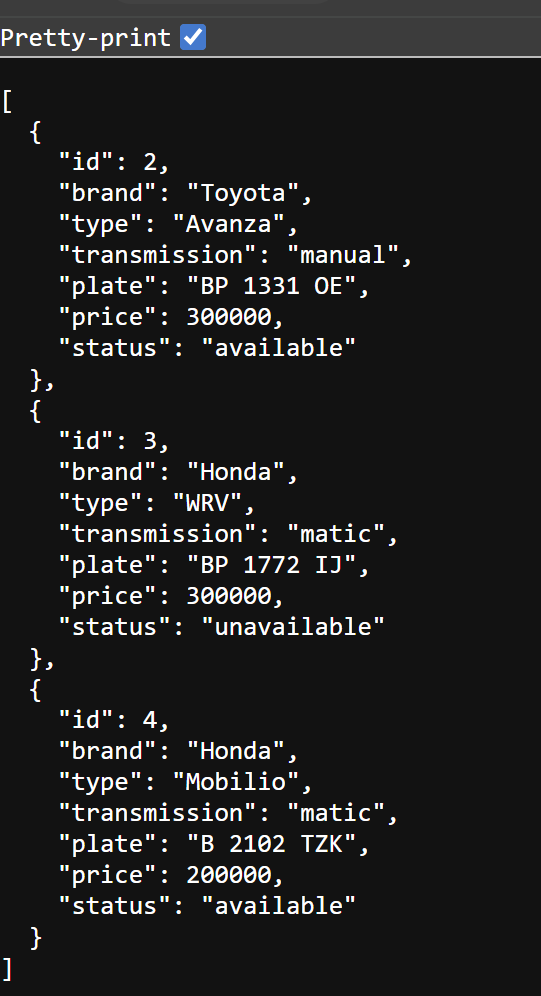
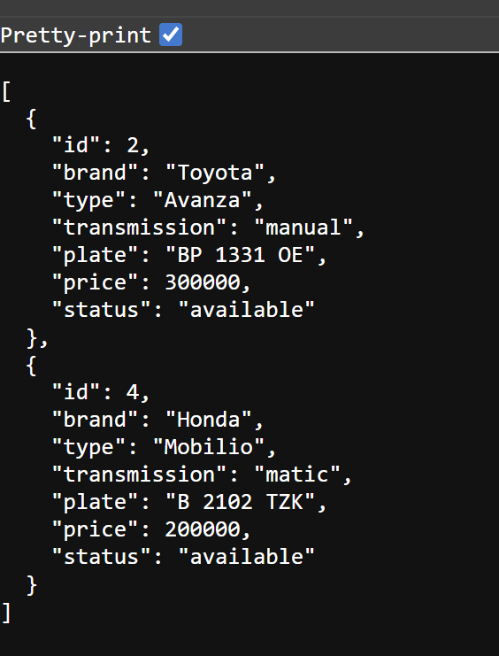

# Vehicle Rental API

## 1. Deskripsi Project
Project ini merupakan RESTful API sederhana untuk manajemen data kendaraan sewa.  
API ini memungkinkan pengguna untuk melakukan operasi CRUD (Create, Read, Update, Delete) terhadap data kendaraan seperti brand, tipe, transmisi, plat nomor, harga, dan status ketersediaan.

API dibangun menggunakan:
- Node.js (Express.js)
- SQLite (better-sqlite3)
- Docker (containerization)
- GitHub Actions (CI/CD)

---

## 2. Dokumentasi API
### Endpoint List
| Method | Endpoint | Deskripsi |
|--------|--------|----------|
| GET | /items | Mengambil semua data kendaraan |
| POST | /items | Menambahkan kendaraan baru |
| PUT | /items/:id | Update data kendaraan |
| DELETE | /items/:id | Menghapus kendaraan |

### Contoh Request & Response

#### GET /items (Success) "http://localhost:3000/items"
```json
[
    {
        "id": 2,
    }
]
```



#### POST /items (Success) "http://localhost:3000/items"
```json
[ 
    {
        "brand": "Honda",
        "type": "Mobilio",
        "transmission": "matic",
        "plate": "B 2102 TZK",
        "price": 200000,
        "status": "available"
    }
]
```


#### PUT /items (Success) "http://localhost:3000/items/3"
```json
[ 
    {
        "status": "unavailable"
    }
]
```



#### DELETE /items (Success) "http://localhost:3000/items/3"
```json
[ 
    {
        "id": "3"
    }
]
```



## 3. Panduan Instalasi (Docker)
### Menjalankan Aplikasi
docker-compose up --build

### Akses API
http://localhost:3000/items

### Informasi Port
| Host Port | Container Port |
|--------|--------|
| 3000 | 3000 | 

## Cara Testing API
### Gunakan:
- Postman
- Thunder Client